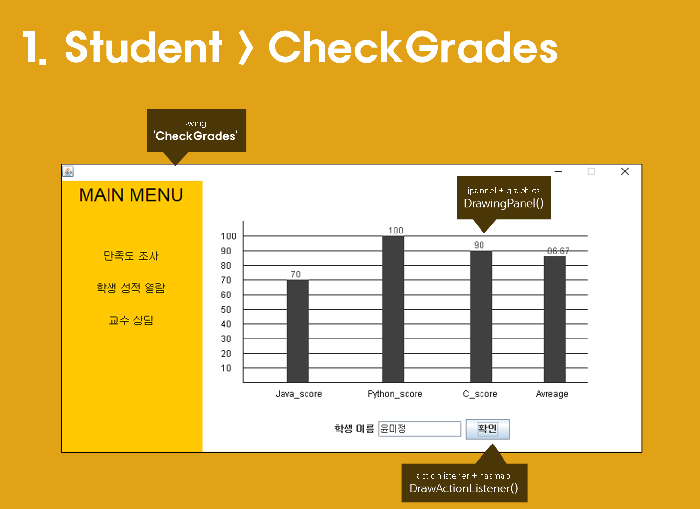

# JAVA_Grade
2020.06.22 - 2020.06.26

## 프로젝트 소개

----

## 담당 기능 소개
- _로그인 / 쓰레드처리_  
  - 성원/현수 ->(Login.java)

- _학생모드_
  - 재욱/현수 ->(StudentPage.java)
  - 성적열람 : 미정 /현수 -> (CheckGrades.java)
  - 만족도평가 : 미정/현수 -> (SatisfactionSurvey.java, Satisfaction_write.java)
  - 지도교수 상담(TCP/IP) : 미정/현수 -> (CounselingStu.java, CounselingAdmin.java)
  - 장학생 조회 : 성원/현수 -> (Scholarship_Student.java)

- _관리자모드_
  - 지형/병찬 -> (AdminPage_Main.java)
  - 학생정보입력 : 지형/지형,병찬 -> (AdminPage_Student_Input.java)
  - 학생정보조회 : 재욱/병찬 -> (AdminPage_StudentCheck.java)
  - 학생성적수정 :  성원/병찬-> (AdminPage_Student_Sc_Input.java)
  - 학생정보삭제 :  지형/재욱,병찬 -> (AdminPage_Student_Del.java)

- _데이터 read / write_
  - 병찬 -> (File_writer.java, File_read.java)

- _데이터 Class / hash 구조_
  - 현수 -> (Student_Data_Method.java)

----

## 구현 기능 소개

1. Check Grades
  - 학생의 이름을 입력하면 등록한 성적이 막대그래프로 표현
    

2. SatisfactionSurvey
  - 만족도 조사를 할 학생의 이름을 입력한 후에 과목을 선택하고, 제출. 만족도를 했을때만 장학생조회를 할 수 있음.

3. CounselingStu
  - Socket을 통해 교수와 상담 진행

4. CounselingAdmin
  - 연결된 Socket을 통해 학생과 상담을 진행

